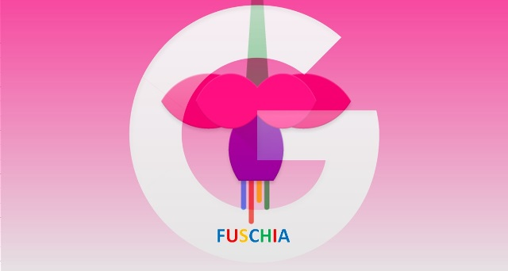

# 谷歌的FuchsiaOS&它相对于安卓的优势

<!-- Google has two well-known operating systems like Android and Chrome OS in the market. Although the company never leave a successful product alone in a marketplace, though, it is also developing a new operating system known as “Fuchsia” It also helps in evolving pile of code. In May 2017, Fuchsia was updated with a system UI and running at the top of Android, where it has functioned like an application. The UI provided a neat multiple window environment, but usually, it was just a set of placeholder graphics. In this blog, we are going to discuss more information about what is Google Fuchsia OS and Google’s Fuchsia features. -->
#### 如今，谷歌在市场上已经拥有了两大知名的操作系统，Android 和 Chrome OS。尽管谷歌公司已经在市场上留下了大量的成功产品，但它仍然在开发一个全新操作系统”Fuchsia“，它同时也需要编写大量代码。在2017年5月，Fuchsia更新了一个系统UI并运行在Android的顶层，这使得它看起来像一款应用。这个UI提供了一个灵活的多桌面环境，但事实上，那些桌面只是一组图片界面。在这篇文章中，我们将讨论什么是Fuchsia OS 和它的特性。

-----

### 概览：什么是Google Fuchsia 系统？

<!-- Unlike Android OS and Google Chrome OS, Fuchsia is not based on Linux, a new kernel developed by Google. With the help of Fuchsia, Google will not only dumped the Linux kernel, but also GPL; the OS can be licensed under the BSD 3 clause, Apache 2.0, and MIT. Dumping Linux will come as a shock, but Android ecosystem might seem no desire to keep up with its upstream Linux release. However, the Google Pixel that is still stuck in Linux Kernel 3.18, was first released at the end of year 2014. -->
#### 不像Android和Chrome系统，Fuchsia并不基于Linux，而是一个由谷歌开发的新内核。在Fuchsia的帮助下，谷歌不仅会抛弃Linux内核还会放弃GPL；这个系统可以在BSD 3-clause，Apache 2.0，和MIT下获得发布许可。谷歌抛弃Linux内核的做法令人惊讶，安卓系统的生态似乎也无法跟上上游Linux内核的发布。例如，谷歌Pixel手机仍然使用着发布于2014末的Linux内核3.18。

-----

### Fuchsia OS的高级特性

<!-- Fuchsia Graphical Interface
The first thing you notice that when you log in then, Material Design is available in a big way. Google Fuchsia Operating System can use its own special renderer, Escher specializes in the shadow. Your notifications, Windows, buttons, dialog boxes, and create a more cleanly layered, providing a depth to your view. Further, Fuchsia currently offers two different layouts i.e., the mobile-centric design called Armadillo, and traditional desktops known as Capybara. Armadillo will drop the App Drawer and a shortcut model for a combined view of all Recent applications, Quick Settings, and Google Feed too. Capybara is still work in progress, using a taskbar that contains only time, a placeholder for quick settings, and something similar to the start button. 

Google Fuchsia OS is Cross-device OS
In today’s world, many people do not have only one device, but multiple like Phone, desktop, laptop, tablet, and much more. Based on the current status of OS, Google appears to be working to make Google Fuchsia Operating System run in unison.Basically, the problem with this is to maintain progress and context. Once you signed in with Google Account, your applications can save automatically across the devices. Google illustrates Ledger as a distributed storage system for Fuchsia and everything will be stored in the cloud.

Fuchsia seems to be Assistant
Google Fuchsia OS is mainly designed to accommodate the Google Assistant. Moreover, everything will be shown on screen, everything that you have done and anything you can do is more visible to the Google Assistant or take a look at the current Fuchsia documents. Assistant on any Android smartphone may inspect your screen for useful information when you hold the home button, but Google Fuchsia OS provides even deeper access. In the Fuchsia, you can keep your browser and easily see the review of restaurant, even you can open the calendar to check the current date, and so on.

-->

> ### Fuchsia 图像界面
> #### 当你登陆系统后注意到的第一件东西是它宏大的Material Design。Fuchsi系统可以使用它自己独有的渲染器比如专注于阴影的Escher。你的通知，窗口，按钮，弹窗会创建在一个更清晰的图层中并提供视觉深度。更者，Fuchsia现在提供了俩种不同的图层，比如有叫做Armadillo那样以移动设备为中心的设计和Capybara那样传统的设计。Armadillo将放弃App Drawer还有那为了同时查看所有最近的应用程序，快速设置，Google Feed的快捷模型。Capybara仍在开发中，它有着仅包含时间的任务栏，用于快速设置的界面以及类似于开始按钮的东西。
> 
> ### Fuchsia 是跨设备系统
> #### 在当今世界，很多人不只有一台设备，而是多种设备，如手机，台式机，笔记本电脑，平板电脑等等。根据这种现状，谷歌似乎正在努力使Fuchsia在所有设备上运行一致，这样要解决的问题是去维护进程和上下文。一旦你登入谷歌账户，你的应用可以自动跨设备存储。谷歌将Ledger描述为Fuchsia的分布式存储系统，所有内容都将存储在云中。
> ### Fuchsia可能是个智能助理
> #### Fuchsia主要被设计去适配谷歌助手。此外，所有内容都会在屏幕上显示，所有你已经完成的和你能做的东西都可以被谷歌助手获取。当你按住home键时，Android智能手机上的智能助理只会检查您的屏幕以获取有用信息，但Fuchsia系统会提供更深层次的信息。在你使用你的浏览器同时，你还可以很方便地查看餐馆的评价，甚至同时打开日历查看今天的日期，等等。

------

### Google Fuchsia OS相对于Android / Chrome OS的优势

<!-- As everyone knows, Android and Chrome both operating systems are based on Linux, which contains a solid foundation. One problem with Android is that before Treble, a patch to the latest Linux kernel was reliant on device OEMs (original equipment manufacturer) putting in the hard work, which few did. As of now, after Treble, some of these OEMs are reluctant to include it in their devices. The Android users can potentially vulnerable to exploit that has already been patched the upstream.

Google Fuchsia Operating System avoids all these pitfalls by using a custom kernel, Zircon, which is designed to be more consistently upgradeable. To make this possible, few applications are isolated from a direct kernel access. This will give an extra layer of security and prevents those applications from being incompatible after system upgrade, an issue that has plagued the Android before.

-->
#### 众所周知，Android和Chrome这两种操作系统都是基于Linux这个坚实的基础。Android的一个问题是，在Treble之前，最新Linux内核的补丁的更新依赖于设备OEM（原始设备制造商），但很少有人这样做。截至目前，在Treble实施之后，仍有些OEM不愿意将Treble包含在他们的设备中，因此这些Android设备的用户不能即时更新补丁。
#### Fuchsia使用定制的，可被持续更新的内核Zircon来避免这些陷阱。几乎没有应用能直接访问内核，这将提供一个额外的安全层，并防止像之前安卓那样，在系统更新后出现应用不兼容的情况。

翻译自：[https://blog.systoolsgroup.com/googles-fuchsia-operating-system/](https://blog.systoolsgroup.com/googles-fuchsia-operating-system/)
